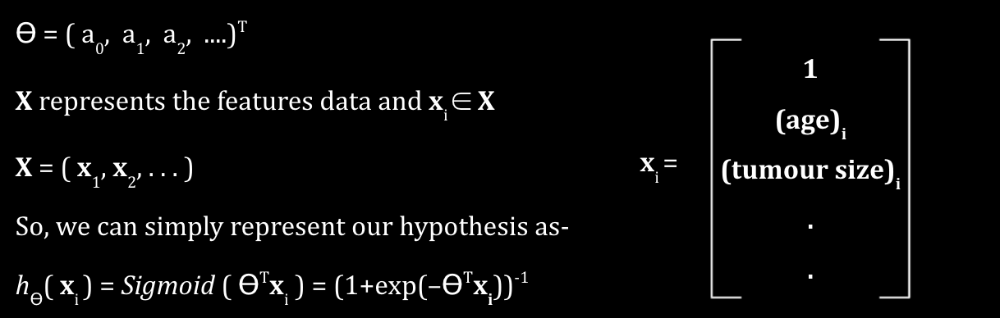

# Loss function

1. What is a loss function
2. How algorithm learns
3. Some standard loss functions

This article covers a fundamental concept in machine learning. i.e., Loss function. But before that, in brief, let's set up a structure that will help understanding it better.
Machine learning algorithms are a set of computational algorithms; here, the algorithm is a set of statistical processing steps that uses experience/data and finds parameters or patterns to make the best decisions.

A very famous engineering-oriented definition of machine learning is–
> "A computer program is said to learn from experience E with respect to some task T and some performance measure P, if its performance on T, as measured by P, improves with experience E."
> 
> *Tom Mitchell, 1997*

To explain this idea better, let's consider a toy example. We want to develop a classification system that outputs "1" if a patient has breast cancer (malignant type) and "0" if a patient is fine. And we have a dataset of females who took the test. We noted a few features like age, tumour size, clump thickness, and uniformity of cell shape, etc. 
If you don't know the details of classification algorithms now, that's okay. Here our task (T) is predicting whether a tumour is malignant or not. Our algorithm is learning for the dataset of previous tests, so we will call it experience (E). And let's define the performance measure (P) as the ratio of correctly classified labels ("0" or "1"). This particular performance measure is called accuracy.
To develop our classification algorithm, we will construct a hypothesis (a function which maps features to the desired range. Here, the hypothesis outputs a value in a range (0, 1))–

          
Here, 

X = ( x1, x2, . . . )
So, we can simply represent our hypothesis as-
hϴ( xi ) = Sigmoid ( ϴTxi ) = (1+exp(-ϴTxi))-1

We have chosen the sigmoid function because its range is (0, 1). So h( z ) ∈ (0, 1). Based on the value of the hypothesis, we can assign a label to xi. If our hypothesis is greater than a threshold value, we will assign yi = 1, else yi = 0. 
For example lets take threshold = 0.5, then–
hϴ( xi ) ≥ 0.5 ⇒ yi = 1 ≣ ϴTxi ≥ 0 ⇒ yi = 1
hϴ( xi ) < 0.5 ⇒ yi = 0 ≣ ϴTxi < 0 ⇒ yi = 0

The coefficients we have used above, { a0, a1, a2, .... } are called model parameters. We don't know the exact parameter's value, and when we say an algorithm is learning, it implies that the algorithm is trying to find the correct value of model parameters. And to do that, we need a metric that tells whether the parameter's value is close to the actual value or not. And that metric in machine learning is called loss function.
What is a loss function?
As said above, we want the loss function to tell the algorithm whether the current parameters' values are correct or need to be updated. The form of loss function may depend on the type of model and the data. For example, a general way to construct a loss function for supervised learning algorithms is to measure how far the estimator (model's prediction for a particular iteration) is from the actual value for a given an example. In our example, we can define loss function as-. 
L (hϴ(xi), yi) = (hϴ(xi) – yi)2 
The above loss function is the mean squared error (MSE) loss and is generally used in regression-based problems. But using MSE in classification problem is not preferred because the sigmoid function will make L (hϴ(xi), yi) non-convex. In a classification problem, generally binary cross-entropy loss (or log-loss) is used-
L (hϴ(xi), yi) = yi x ln hϴ(xi) + (1 – yi) x ln ( 1 – hϴ(xi)) 

If the true label of y is one and the hypothesis, h, outputs value 0 implies that the binary cross-entropy loss will be infinity, similarly, for the other case. The loss increases logarithmically if the hypothesis outputs a value far from the true label.

In the above figure, the first figure shows the distribution of malignant & non-malignant tumour. In the second and third figures, the value of parameters is such that the algorithm assigns a label “0” or “1”. In both cases, the log-loss is much higher as compared to the log-loss in the last figure. In the last figure, the black-dashed line shows the decision boundary. All the cases to the left side of the line are assigned a label “0”. 
Before we proceed to the next section, a small note– while learning ML, you may come across a similar term: the cost function. And there is a difference between a loss function and a cost function. The loss function calculates the loss (or wrongness) for a single example. Whereas the cost function calculates the average loss over the dataset on which the algorithm is trained. 
Cost (hϴ(xi), yi) = 1mi=1mL (hϴ(xi), yi);  here, m represents the size of the training set.
Though, in some places, you may find that both terms are used interchangeably.
How do algorithms learn?
For a given loss function, an algorithm learns by minimising loss at each iteration. Usually, finding the value of parameters for which the cost function attain its global minima is not that easy. So we rely on numerical optimization techniques like Newton-Rephson, Gradient descent, etc. Using these numerical techniques, we can find the values of model parameters at the local minima of the cost function. If the function is convex, the local minima will be the global minima.
If you are new to numerical optimization methods, they are framed in the following way– We have an objective function that needs to be either minimized or maximized. Newton-Raphson or Gradient descent/ascent generate a sequence such that they will converge to the local minima/maxima in a deterministic way. While training a learning algorithm, the objective function is the cost function. For many learning algorithms, a globally continuous and differentiable cost function is desirable.
Some standard loss functions
For regression-based problem, some common loss functions are-
Mean square loss (or quadratic loss)

L(yi, yi) =(yi-yi)2
Cost (y, y) = 1mi=1m(yi-yi)2 

It is the most commonly used in regression problems. One disadvantage it has is its tendency to be dominated by outliers.

Mean absolute loss

L(yi, yi) =| yi-yi |
Cost (y, y) = 1mi=1m| yi-yi | 

Mean absolute loss is helpful when we know that the data might have a lot of outliers. A disadvantage is that it is not differentiable at mean, and except at mean, the gradient is the same. 
For classification based problem– 
Log loss or binary cross-entropy loss

L(yi, h(xi)) =-yilog(h(xi)) 
          -(1-yi)(1-log(h(xi)))
Cost (y, y) =1mi=1mL(yi, h(xi)) 

A generalized version of binary log-loss is known as Categorical cross-entropy loss. It is widely used for classification problem. You can interpret it as a negative log-likelihood.

KL (Kullback Leibler) divergence loss (or entropy loss)
KL(P || Q) = -SP(s)logQ(s)P(s)
or 
KL(P || Q) = -SP(s)logQ(s)P(s)

For discrete case

For continuous case

Kl divergence quantifies the difference between two distribution (one of them is take). It is used in reinforcement learning as well. 

